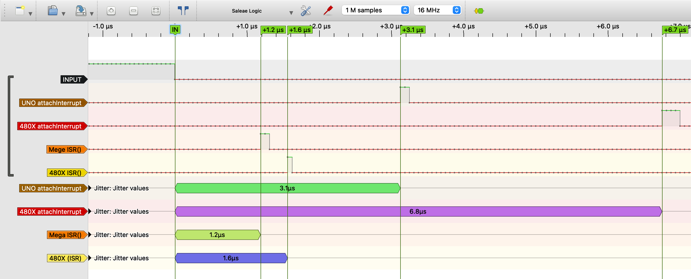
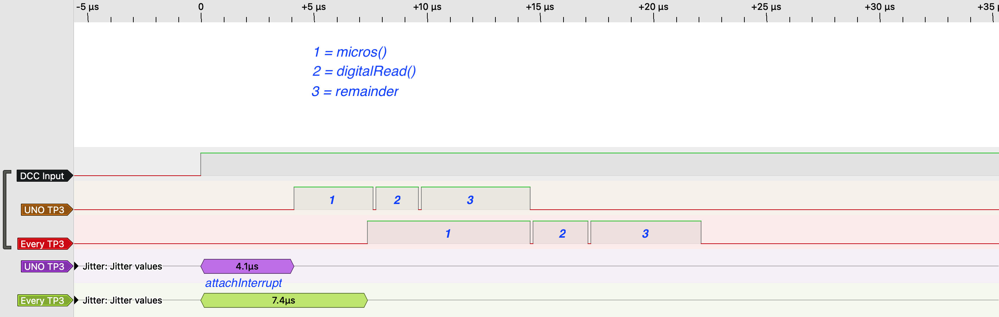

# Arduino and external interrupts #

ATMega processors enable interrupts from pins, timers, USARTS, the ADC etc.  For each of these interrupt sources a dedicated interrupt vector exists. An example is `TCB0_INT_vect`, which is the interrupt vector for Timer TCB0. An example of a bare timer ISR is shown below.
```
ISR(TCB0_INT_vect) {
   // do something
}
```
As discussed in Nick Gammon's excellent interrupt blog ([http://www.gammon.com.au/interrupts](http://www.gammon.com.au/interrupts)), with a 16Mhz clock it would take 1,4375 µs between the moment the interrupt was raised, and the "do something" was reached. Leaving the ISR takes another 1,1875 µs, so the total overhead of such bare ISR is 2,625 µs.

## *External interrupts*, *pin change interrupts* and *PORT interrupts* ##
An external interrupt source, such as a DCC or RS-bus input signal, can be connected to one of the ATMega micro-controller pins. The decision which pin to use has major consequences regarding timing (performance), however, since ATMega processors support  different interrupt approaches: *external interrupts*, *pin change interrupts* and *PORT interrupts*.

- **External interrupt:** early ATMega processors, such as the ATMega 8535, 8, 16 and 328 (Arduino UNO and Nano), support only *external interrupts* and only on two pins: INT0 and INT1.
- **Pin change interrupt:** later generations of ATMega processors, such as the 164, 324, 644, support three external interrupts (INT0, INT1 and INT2), but in addition also *pin change interrupts*. The 2560 supports, next to pin change interrupts, even eight external interrupts!
- **PORT interrupt:** The newest generation of ATMega processors, such as the ATMega 4808, 4809 and AVR128DA (the MegaCoreX and DxCore processors) no longer support external interrupts, but only pin change interrupts. Newer data sheets use the term *PORT interrupt* instead (note: the data-sheets sometimes also call these interrupts again *external interrupt*, which may lead to confusion).

Since the number of external interrupt is generally small, the Microchip designers could define a dedicated interrupt vector per external interrupt. Thus, whenever an external signal raises an interrupt, the processor already knows the associated interrupt vector and can immediately jump to the associated ISR.

Basically any pin that is connected to an ATMega port can trigger a *pin change interrupt* or *PORT interrupt*. However, to limit the number of possible interrupt vectors, the Microchip designers decided that all pins that belong to the same Port share the same interrupt vector. Thus, when pin PA1 and PA2 of port A both raise an interrupt, the processor jumps in both cases to the ISR that belongs to port A. Within that ISR the first thing that needs to be done, is to determine whether pin PA1 or PA2 raised the interrupt.

## attachInterrupt ##
The default Arduino approach to associate a pin interrupt to an Interrupt Service Routine (ISR), is to use the Arduino `attachInterrupt()` function. An example is ``` attachInterrupt(digitalPinToInterrupt(myPin), myInterruptFunction, RISING) ```. Within the `attachInterrupt()` function a call is made to the `myInterruptFunction`, which contains the actual interrupt code. This call results into additional cycles, and according to Nick Gammon's blog the overhead of `attachInterrupt()` has increased from 2,625 µs (for the bare ISR) to 5,125 µs. Entering the interrupt handler costs 2,9375 µs, and returning costs 2,1875 µs.

## attachInterrupt on modern micro-controllers ##
The interesting observation is that on modern ATMega micro-controllers the `attachInterrupt()` function is less efficient than on older micro-controllers. This may seem counterintuitive, since these new processors require for the push instruction at the start of the ISR only a single clock tick, and should therefore be twice as fast. The real reason however is that with older controllers a designer could take, for time-sensitive tasks, one of the external interrupt pins, such as INT0, INT1 or INT2. The MegaCoreX and DxCore processors no longer support *external interrupts*, but instead only *PORT interrupts*. The `attachInterrupt()` function therefore needs to also include code to determine which of the pins of that port raised the interrupt, before the `myInterruptFunction` starts executing.

# Measurements #
The figure below shows the difference between traditional and modern ATMega processors. The input signal raises an interrupt at the falling edge of its signal.
- In case `attachInterrupt()` is used with a traditional processor, such as the 328 (used by the Arduino UNO and Nano) it takes roughly 3,1 µs before the user code within the interrupt routine gets executed. This measured value matches the value measured in Nick Gammon's blog.
- In case `attachInterrupt()` is used with a modern processor, such as the 4809 (used by the Arduino Nano Every), the overhead that is required before the user code gets executed has more than doubled to 6,8 µs.

The figure also shows the overhead required if we wouldn't use the `attachInterrupt()` function, but write bare ISR code. A traditional processor, such as the 2560, needs only 1,2 µs before the user code starts. A modern processor, such as the 4809, needs only a little bit extra time (to clear the interrupt flag): 1,6 µs. For completeness the test code is included as well. See also the discussion on the Arduino Forum for additional details (link included at the bottom of this page).

```
void test_interrupt(void) {
#if defined(__AVR_ATmega328P__)
  PORTD |= (1<<2);
  PORTD &= ~(1<<2);
#endif
#if defined(__AVR_ATmega4809__)
  PORTF.OUT |= PIN2_bm;
  PORTF.OUT &= ~(PIN2_bm);
#endif
#if defined(__AVR_ATmega4808__)
  PORTF.OUT |= PIN2_bm;
  PORTF.OUT &= ~(PIN2_bm);
#endif
}

#if defined(__AVR_ATmega2560__)
ISR(INT2_vect) {
  PORTF |= (1<<2);
  PORTF &= ~(1<<2);
}
#endif

#if defined(__AVR_ATmega4808__)
ISR(PORTF_PORT_vect) {
  PORTF.INTFLAGS=8;                    // we know only PF3 has an interrupt, so that's the only flag that could be set.
  PORTF.OUTSET = PIN2_bm;              // turn PF2 output on  - Instruction takes 1 CPU cycle
  PORTF.OUTCLR = PIN2_bm;              // turn PF2 output off - Instruction takes 1 CPU cycle
}
#endif


void setup() {
  #if defined(__AVR_ATmega328P__)
  pinMode(2, OUTPUT);                  // Set PD2 as output
  pinMode(3, INPUT_PULLUP);            // Set PD3 as input (INT1, Digital pin 3)
  attachInterrupt(digitalPinToInterrupt(3), test_interrupt, FALLING );
  #warning UNO
  #endif

  #if defined(__AVR_ATmega4809__)
  PORTF.DIR |= (1 << PIN2_bp);         // Set PF2 as output
  pinMode(19, INPUT_PULLUP);           // Set PF3 as input (Digital pin 19)
  attachInterrupt(digitalPinToInterrupt(19), test_interrupt, FALLING );
  #warning 4809
  #endif

  #if defined(__AVR_ATmega2560__)
  DDRF  |= (1<<2);                     // Set PF2 as output
  EIMSK |= (1<<INT2);                  // Enable INT2 (PD2 - Digital pin 19)
  EICRA |= (1<<ISC21);                 // Falling
  #warning MEGA
  #endif

  #if defined(__AVR_ATmega4808__)
  PORTF.DIR |= (1 << PIN2_bp);         // Set PF2 as output
  pinMode(PIN_PF3,INPUT_PULLUP);       // Set PF3 as input.
  PORTF.PIN3CTRL=0b00001011;           // PULLUPEN=1, ISC=0x3 => trigger falling
  #warning 4808
  #endif
}

void loop() {
}
```
## Example: DCC decoding and modern micro-controllers ##
If code that runs on traditional ATMega processors is ported to modern ATMega processors, the performance penalty may be substantial.
An example for the NMRA DCC Library (V2.0) is shown below. We see the time needed for an Arduino UNO (328) and a Nano Every (4809) to capture and analyse the DCC input signal (Test Point 3). The UNO takes needs roughly 15 µs, whereas the Nano Every needs around 22 µs. If we investigate what contributed to these times, we see that the overhead for attachInterrupt() is around 4,1 µs (UNO) versus 7,4 µs (Every). But also the *micros() part*, which is used within the NMRA-DCC decoding algorithm, is relatively expensive: 3,5 µs (UNO) versus 7,2 µs (Every). The digitalRead() takes roughly 2 µs (UNO) versus 2,4 µs (Every). The remaining code is, as can be expected, for UNO and Every roughly the same (4,9 µs). See also the discussion on the NMRA-DCC Forum (link included at the bottom of this page)


# What can be done? #
Although `attachInterrupt()` (and `micros()`) is considerably slower on MegaCoreX and DxCore processors, these new processors also include a number of new peripherals that allow much faster and more precise decoding of DCC and RS-bus input signals.
- For decoding the DCC signal, the most important new peripheral is the **event system**, which allows us to directly connect an input pin to a TCB timer. This is implemented by the AP_DCC_Library. As a result, the time needed for DCC decoding could be reduced to (two times) 3 to 4 µs.
- For decoding the RS-bus input signal, a good alternative is to use the **Real Time Clock** (RTC) for counting RS-bus input pulses. This is implemented by Version 2 of the RSbus library.
- An alternative is to not use `attachInterrupt()` and write direct ISR code (like `ISR(PORTA_PORT_vect)`). The problem with that approach is that if somewhere else (for example by a library) `attachInterrupt()` is still called, a duplicate ISR vector usage will be detected and compilation stops. Newer versions of DxCore (V1.3.8 and higher) introduce a *manual mode* option, which expects `attachPortXEnable()` (X is the port, thus A, B, C ...) to be called before `attachInterrupt()`. This allows `attachInterrupt()` for some ports in combination with direct ISR code for other ports.

# References #
- https://forum.arduino.cc/t/difference-in-time-between-interrupt-start-on-mega-2560-and-nano-every-4809/897591
- https://github.com/mrrwa/NmraDcc/issues/57
- https://github.com/SpenceKonde/DxCore/blob/master/megaavr/extras/Ref_Interrupts.md
