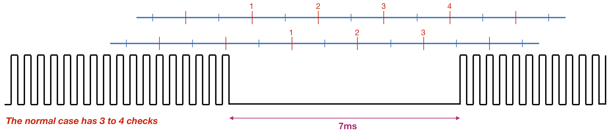
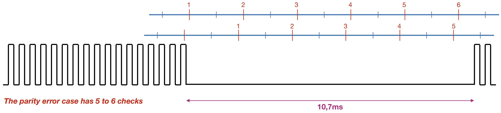
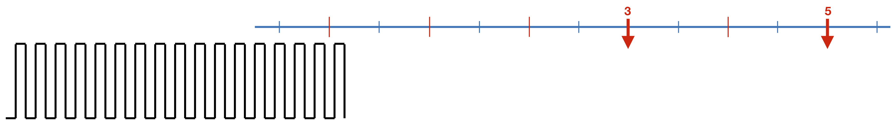

# RS-bus - Check Polling #

`CheckPolling()` is responsible to (re)initialise during the 7ms silence period the counter that determines which RS-bus address is currently polled. The loop within the main sketch should call `checkPolling()` as often as possible. To avoid excessive load of the processor, the first check within `checkPolling()` is whether 2ms have passed since its previous activity. For that purpose the `tLastCheck` parameter is maintained. Only every 2ms `checkPolling()` performs actions.
```
void RSbusHardware::checkPolling(void) {
  unsigned long currentTime = micros();                // will not chance during sub routine
  if ((currentTime - rsISR.tLastCheck) >= 2000) {      // Check once every 2 ms
    rsISR.tLastCheck = currentTime;   
    ...
  }
}
```
The figure below shows (the marks on the blue line) how the Arduino `millis()` timer increases. Only every two milliseconds `checkPolling()` becomes active (red marks on the blue line). As can be seen, within a 7ms silence period `checkPolling()` becomes active 3 or 4 times.


In case the command station detects a parity error, the silence period will be increased to roughly 5 or 6 times.


#### Detecting the silence period ####
Each time `checkPolling()` becomes active it compares the current pulse counter value (`currentCnt`) to the previous value (`lastPulseCnt`). If both values are identical, we *might* be in a silence period. We  increase a `timeIdle` counter. If both values are not identical, we reset `timeIdle` to 1.
```
currentCnt = xxxx
if (currentCnt == rsISR.lastPulseCnt) {            // This may be a silence period
  rsISR.timeIdle++;                                // Counts which 2ms check we are in
  ...
  else {                                           // Not a silence period
    rsISR.lastPulseCnt = currentCnt;               // Store current addressPolled
    rsISR.timeIdle = 1;                            // Reset silence (idle) period counter
  }
}
```
The way `currentCnt` is determined, depends on the way pulse are counted:
- In case of software-based counting, we use the `addressPolled` parameter that is updated every time the ISR fires.
- In case of RTC-based counting, we use the `RTC.CNT` register that is updated every time the RTC receives a (RS-bus) clock pulse.
- In case of TCB-based counting, we use the `TCBx_CNT` register that is updated every time the TCBx receives a (RS-bus) clock pulse.

#### What to do during the silence period ####
As shown in the figure below, we only become active if `timeIdle` is equal to 3 or, in case a parity error is detected, `timeIdle` is equal to 5. In case of a parity error the `parityErrors` counter will be increased. The main program may monitor the `parityErrors` counter, and if this counter is regularly increased there may be a problem with the RS-bus. Possible causes include cabling problems, external interference but it can also be that two feedback decoders use the same RS-bus address.

```
switch (rsISR.timeIdle) {                        // See figures above
  case 1:                                        // RTC.CNT differs from previous count
  case 2:                                        // May also occur if UART send byte
  case 4:                                        // Same as case 3, nothing new
  case 6:                                        // Same as case 5, nothing new
  break;
  case 3:                                        // Third check => Check if things are OK
    ...
  break;
  case 5:                                        // Fifth check: 8ms of silence => parity error
    parityErrors++;                              // Keep track of number of parity errors
  break;
  case 7:                                        // Seventh check: 12ms of silence => signal loss
    parityErrors--;                              // Wasn't a parity error after all
    rsSignalIsOK = false;                        // But worse: a RS-bus signal loss
    rsISR.data2sendFlag = false;                 // Cancel possible data waiting for ISR
    rsISR.data4usartFlag = false;                // Cancel possible data waiting for ISR
  break;
  default:                                       // Silence >= 14ms
  break;
};

```
The code above also shows that we may detect longer (than 12ms) periods of silence. Such long periods of silence means that we lost the RS-bus input signal. In case the signal reappears later, the feedback decoder needs to be synchronised again.

#### Check if we are synchronised ####
During the third check we will investigate if we counted 130 pulses during the previous cycle. If that is the case, things are OK and we may set the `rsSignalIsOK` flag to denote that we detected the start of a new RS-bus polling cycle. If we did not count 130 pulses, the decoder is not synchronised to the master station and the `rsSignalIsOK` flag should be cleared. If things are OK, the pulse counter must be reset. How this is done depends on the decoding mechanism being used (software, RTC or TCBx); for details see the respective .cpp files.

## Error Handling ##
Depending of the specific error that occurs, this library can take several error correcting actions. A description of these actions is given in [BasicOperation-ErrorHandling.md](BasicOperation-ErrorHandling.md).
