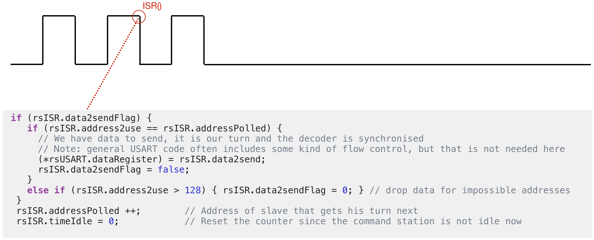
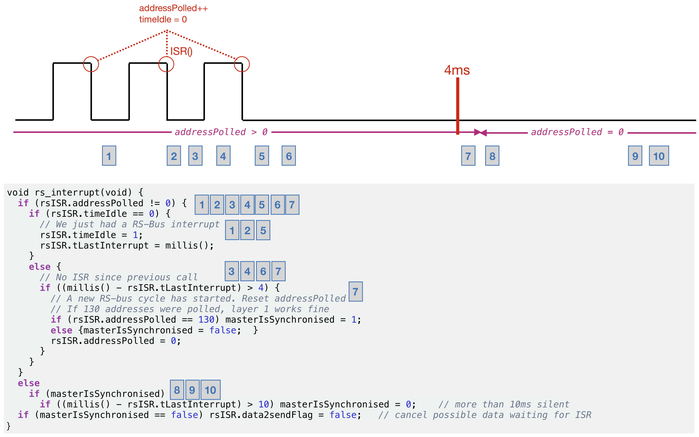

# RS-bus - Version 1 #

The rs_interrupt() ISR is called whenever a transition is detected on the RS-bus. Such transition indicates that the next feedback decoder is allowed to send information. To determine which decoder has its turn, the ISR increments at each transition the `addressPolled` variable. If data is made available to the ISR (the `data2sendFlag` is set and the data has been entered into the `data2send` variable, the data will be send once the `addressPolled` variable matches the address (`address2use`) of this decoder (with offset 1). The ISR also resets the `timeIdle` variable, to allow `checkPolling()` to detect the silence period preceding each new polling cycle. In normal operation this silence period is 7 ms.

The actual data transfer is performed by the Interrupt Service Routine (instead of the main loop) to ensure that:
 - data is send immediately after the feedback module gets its turn, and
 - to ensure only a single byte is send per polling cycle (flow control).

Data is offered from the `RSbusConnection` object to the ISR using a `data2send` variable, in combination with a `data2sendFlag` and an `addres2use`. The `prepare4bit()` or `prepare8bit()` methods of the `RSbusConnection` object ensure that this `data2send` variable is used in accordance with the RS-bus specification, which means that the parity, TT-bits, nibble (high or low) and four data bits will be set. The prepare4bit() and prepare8bit() methods do not send the data themselves, but store it in a FIFO buffer.
This FIFO queue is emptied by the checkConnection() method, which should be called from the main program loop as frequent as possible. Once the ISR is ready for new data (`data2sendFlag == false`), the data is taken by the checkConnection() method from the FIFO.

## CheckPolling ##
For the `timeIdle` variable we use a value of 4 ms (4000 microsecond), which seems a save choice. If there has been more than 8 ms of silence, we conclude that the synchronisation with the master has been lost.

The 4 ms idle period allows all feedback modules to synchronise (which means, in our case,that the `addressPolled` variable is reset to zero). To detect the idle time, `checkPolling()` maintains the `tLastInterrupt` attribute, which saves the current time (in microseconds). If 4 ms (4000 microseconds) have passed, `checkPolling()` resets the addressPolled counter to zero.
Since the decoder can (re)start in the middle of a polling cycle, `checkPolling()` also sets the `rsSignalIsOK` attribute once the start of a new RS-bus polling cycle is detected.

After start-up, or after the master station resets, the decoder should first connect to the master by sending two 4 bit messages (the high and low order nibble) in two consecutive cycles. To signal that such connect is needed, the `feedbackRequested` flag is set by the `checkConnection()` method. Upon start-up, this flag is initialised to zero (no need to connect yet, since the beginning of a new polling cycle has not yet been detected). This flag is also set to zero if the RS-bus master resets (which the master indicates by sending a pulse of 88 ms, followed by silence period of roughly 562 ms). The `check_RS_bus()` method maintains a state machine to determine if we are in the start-up phase, if the start of a new polling cycle has been detected, if we already have send both connection nibbles and if we are connected.

