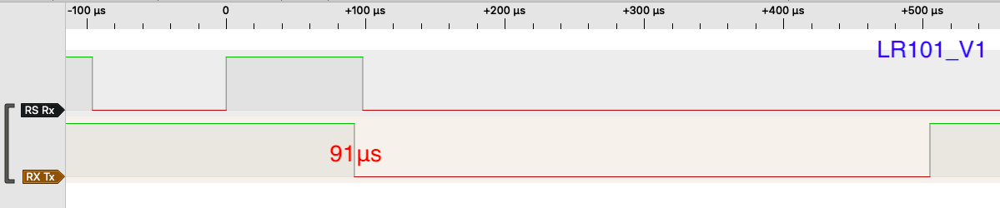
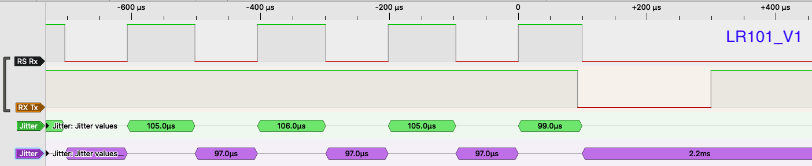
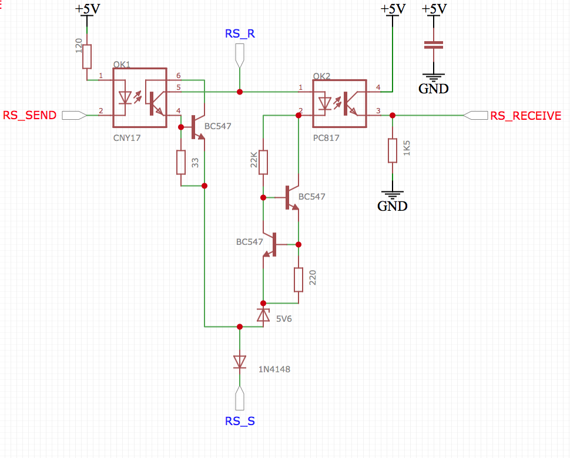
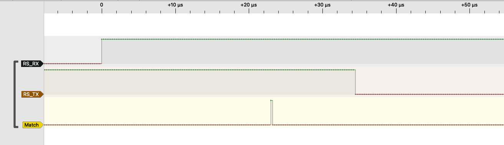
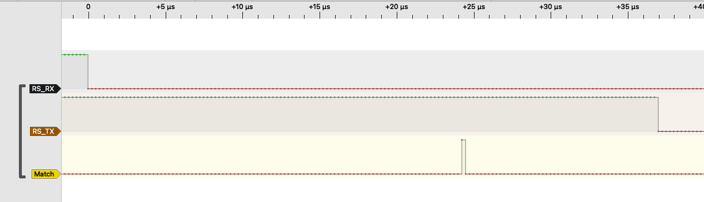
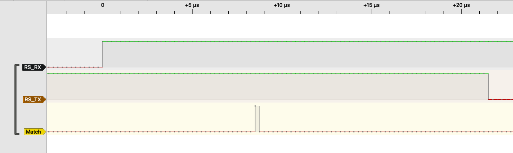
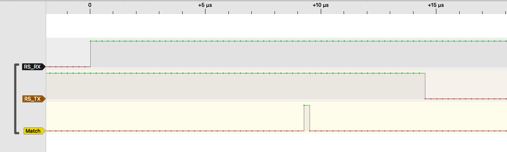
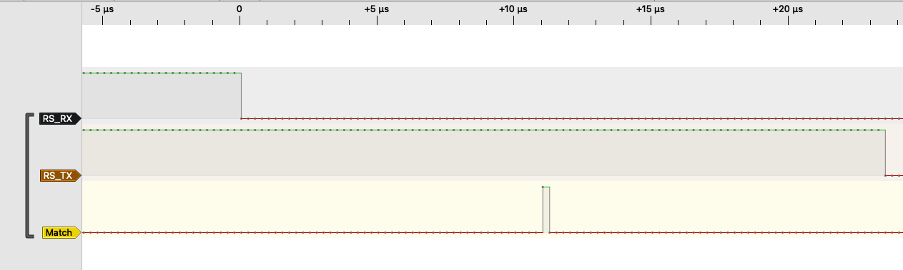

# When to trigger #

Once the pulse is counted that belongs to the RS-bus address, the question is when to start to sending: at the rising edge of the received RS-bus input signal or at the falling edge. If the rising edge is chosen, the master station is still sending current at the moment the USART starts sending the feedback data. If the falling edge is chosen, response time becomes larger.

The figure below show timing of the Lenz LR101 (V1) feedback module. As can be seen, USART transmission starts 91μs after the rising edge of the received RS-bus input pulse. LDT feedback decoders show a similar behaviour. The default for this library is therefore rising edge. However, in practice both rising and falling edge seem to work (note: in earlier versions of this library the falling edge was used).

## Lenz LR101 details ##
An interesting observation with the LR101 is that the last pulse seems to be shortened from 105μs to 99μs. This seems to suggest that the master station stops sending after it detects the feedback signal. However, this behaviour could not be reproduced with my own decoders, and therefore could be a measurement error.   

## Timing details ##
The following figures show the timing details of the various decoding variants: software, RTC and TCB.
All measurements are made using the [RS-Bus piggy-back print](https://easyeda.com/aikopras/rs-bus-tht) as available from EasyEda. The software was run on a Microchip AVR128DA48 Curiosity Nano, running at 4Mhz. This relative low speed was used to make operation of the logic analyser more reliable. Note however that AVR DA micro-controllers can run on 24Mhz, meaning than reaction times may become considerably (roughly 6 times) shorter than those of the figures below.

## Software-based decoding ##
The figure below shows the (default) software-based decoding variant. After roughly 22μs the RS-bus address is matched, and the USART starts transmitting.

The following figure also shows the software-based decoding variant, but this time the ISR triggers on the FALLING edge of the RS-bus signal. Again the ISR detects that its own RS-bus address is matched after roughly 24μs.
We may conclude that there is hardly a difference between triggering on the RISING or FALLING edge, except that the FALLING edge starts transmission one edge, thus roughly 100μs, later.

## RTC-based decoding ##
The figure below shows the Real-Time Counter (RTC) decoding variant. Next to the fact that the number of interrupts per pulse train is reduced from 130 (with software-based decoding) to 2 (when the RS-bus address is matched and the overflow after 130 pulses), the reaction time after the positive edge went down from 22μs (software-based approach) to roughly 9μs. In this specific measurement the USART started transmission after roughly 24μs; as it turned out this value varies from measurement to measurement (likely due to the USART baudrate clock implementation). Note that this variant is only available on MegaCoreX and AVR-DA micro-controllers. The RTC can only trigger on the RISING edge.

## TCB-based decoding ##
Finally both figures below show the Timer-Counter type B (TCB) decoding variant, which uses the Event system to feed the TCB counter. As could be expected, timing values are comparable to the other hardware decoding variant (RTC). Note that this variant is only available on AVR-DA micro-controllers.

The last figure shows timing if triggered on the FALLING edge. By default the Event system triggers on the RISING edge, but by using PORT invert commands it is also possible to trigger on the FALLING edge. Since performance is better when triggered on the RISING edge, this variant has not been implemented in the library (but could easily be added, if needed). 

