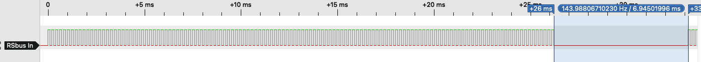

# The RS-bus - Sending data #
The RS-bus has one master station (usually a Lenz LZV100 or LZV200) and up to 128 slaves (the feedback decoders).

The master station polls sequentially all 128 decoders to ask them to send feedback data, if available. A complete polling sequence consists of 130 pulses (see figure below). If there is no feedback data to be send the time between successive pulse trains will be (around) 200 micro-seconds. After all slaves have been polled, the master station will be silent for a period of around 7 milliseconds (the blue area in the figure), after which a new  pulse train starts.


A single pulse (high plus low value) takes 202 microseconds. Depending on the RS-bus hardware and optocoupler, the micro-controller sees a high part of around 113 microseconds and the low part of around 90 (see figure below).


Once the decoder is allowed to send, it sends a start bit followed by 8 data bits, followed by a stop bit. Data is send with 4800 baud, thus 1 bit takes 208 microseconds. The start and data bits together take 1,875 milliseconds 4800 baud). See the figure below, where the start bit (0) is followed by 8 data bits (11001000) and a stop bit (1):


## What is send? ##
The 8 bits that are being send have the following meaning:
- P: Parity bit: Even Parity
- TT: Type bits (see below)
- N: Nibble: low (0) or high (1)
- D0..D3: 4 bits with user data


The TT bits indicate the type of feedback data:
- 00: Switch decoder without feedback
- 01: Switch decoder with feedback
- 10: Feedback decoder
- 11: reserved for future use.

More details are provided in the XpressNet specification, which can be downloaded from the Lenz website. Although XpressNet messages can return to a PC TT bits with a value of 00, the value 00 should never be found in RS-bus messages. The information whether the data comes from a switch or a feedback decoder is used by Lenz handheld devices, such as the LH100.

Although RS-bus messages contain 8 bit of data, only 4 of these bits are used for the actual user data. Such 4 bits data entity is called a nibble. A feedback decoder with 8 inputs therefore needs two nibbles, thus two RS-bus messages (in two pulse trains), to send all 8 bits of user data.

A general problem with **all** switch decoders that are able to send switch positions of *multiple* switches within a single feedback message, is that inconsistent switch positions may be returned to the PC that controls the layout.
See [details on switch feedback problems](switch-feedback_problems.md).

In the figure showed earlier 4 databits are send with value 1000, that belong to the first (low) nibble (0), for a Feedback decoder (TT = 10) with even parity (1).

## When to send? ##
Feedback modules may send information back to the master once their address is polled. For that purpose each decoder counts the RS-bus input pulses to determine the exact moment when it is allowed to send. In the 7 ms period of silence, the decoder (re-)initialises its counter.

The first pulse is used to inform the slaves that a new pulse train has started. If the slave with RS-bus address 1 has data to send, it will do so immediately after the second pulse. This is shown in the figure below, where  the feedback decoder sends 8 bits of data after the second pulse. For sending these 8 bits of data, in general a UART will be used with a baudrate of 4800 baud.


Similarly the figure below shows a feedback decoder with address 128 sending 8 bits of data after the last but 1 pulse (pulse 129).


The two figures above show that data is being send after the FALLING edge of the input signal. That behaviour was the default in  version 1 of this library. However, since version 2 of this library this default was changed to send data immediately after the RISING edge of the input signal. The `interruptModeRising` attribute was added to the RSbusHardware class to override this behaviour. See [the file BasicOperation-TriggerEdge.md](BasicOperation-TriggerEdge.md) for further details.

## Send details ##
Actual byte transmission is performed using a USART (4800baud) within an Interrupt Service Routine (ISR). Using an ISR (instead of code within the main loop ensures that: 1) data is send immediately after the feedback module gets its turn, and 2) only a single byte is send per polling cycle (flow control).

Data is offered from the `RSbusConnection` object to the ISR using a `data2send` variable, in combination with a `data2sendFlag` (in the RTC and TCB variants there is an additional `data4usartFlag`). The `prepare4bit()` or `prepare8bit()` methods of the `RSbusConnection` object ensure that this `data2send` variable is used in accordance with the RS-bus specification, which means that the parity, TT-bits, nibble (high or low) and four data bits will be set. The `prepare4bit()` and `prepare8bit()` methods do not send the data themselves, but store it in a FIFO buffer. This FIFO buffer is emptied by the `checkConnection()` method, which should be called from the main program loop as frequent as possible. Once the ISR is ready for new data (`data2sendFlag == false`), the new data is taken by the `checkConnection()` method from the FIFO buffer.

The general approach is shown below. As can be seen, a pointer is needed to use the USART selected by the `attach()` function. Within the ISR additional checks and code is included, depending on the decoding mechanism being used (software, RTC or TCBx). See the ISR implementations in the respective .cpp files for details.
```
ISR(...) {
  if (rsISR.data2sendFlag) {
    (*rsUSART.dataRegister) = rsISR.data2send;
    rsISR.data2sendFlag = false;
  }
}
```
## Connecting to the master station ##
After start-up, or after the master station resets, the decoder should first connect to the master by sending two 4 bit messages (the high and low order nibble) in two consecutive cycles. To signal that such connect is needed, the `feedbackRequested` flag is set by the `checkConnection()` method. Upon start-up, this flag is initialised to false (no need to connect yet, since the beginning of a new polling cycle has not yet been detected). This flag is cleared whenever the RS-signal is lost (no pulses are seen for a longer period) or, depending on the specific error handling settings, after pulse or parity errors . The `checkConnection()` method maintains a state machine to determine if we are in the start-up phase, if the start of a new polling cycle has been detected, if we already have send both connection nibbles and if we are connected.

## Master station start-up ##
When the (LZV) Master Station start-up, it sends a pulse of around 270ms, followed by a period of silence or rughly 560ms. This period should be sufficient for feedback decoders to initialise its hard and software components. After this silence period is over, the first train of 130 pulses will be send by the master station. As can be seen in the figure below, the decoders using this library wait until the first pulse train is over before they connect to the master station.


## Parity errors ##

If transmission goes well and no parity errors occur, the command station will be silent for a period of 7ms after each pulse train. An example is shown below, where a feedback decoder with address 127 sends a byte with value 01000000 (feedback decoder, lowest nibble, data bits: 0000). The first bit, the parity bit, has value 0, which is correct.


However, if the command station detects a parity error, it will remain silent for a period of over 10ms. An example is shown in the figure below; compared to the previous figure the lowest order data bit is now set (1) but the value of the parity bit remains 0, which is incorrect.

This larger period of silence can be used by a feedback decoder to retransmit the data byte, but can also be used by a RS-bus monitor to measure the quality of RS-bus transmission. If multiple transmission errors are detected, the wiring of the RS-bus may cause problems.


In case of unexpected TT-bits, such as *Switch decoder without feedback* (00) or *reserved for future use* (11), the silence period remains 7ms, thus such bit values are not treated as errors.

A description of what to do after a parity (or other) error is given in [BasicOperation-ErrorHandling.md](BasicOperation-ErrorHandling.md).

# Implementation #

Two functions are implemented by each decoder:
1. counting pulses to determine when to send data,
2. (re)initialising the counter during the 7 milliseconds period of silence. Such (re)initialisation is performed by the `checkPolling()` function; details can be found in the file [BasicOperation-CheckPolling.md](BasicOperation-CheckPolling.md)

There are multiple approaches to implement the counting function:
- Software based: an interrupt is generated after each pulse. The Interrupt Service Routine (ISR) increments the counter, which is reset during the 7ms silence period.
- Hardware based: one of the available Timer/Counter peripherals within the micro-controller is used to count the pulses. The Timer/Counter reads pulses directly from the RS-Bus receive pin, without the help of any software. If the number of pulses matches the decoder's RS-bus address, an interrupt is generated and the data is send.

## Software-based ##
This approach works with most micro-controllers, since no specific hardware peripherals are needed. An interrupts is generated after each RS-bus pulse to increment the pulse counter (see figure below). If the counter matches the decoder's RS-bus address, the decoder is allowed to send 8 bits of data. If it has data to send, it enters this data into the UART send register to initiate the transmission. If it has no data to send, it just passes its turn. The 7ms silence period between two pulse trains is used to reset the pulse counter and perform other house-keeping tasks.


The disadvantage of the software-based approach is that, after each pulse, the ISR is called. Depending on the processor type and CPU speed, each interrupt can take up to 10 microseconds, thereby delaying other, possibly time sensitive, interrupt routines (such as decoding the DCC signal). An extensive discussion of the costs of ISRs can be found on the page [Arduino and external interrupts](Attach_interrupt.md). The conclusion is that on older ATMega processors the software-based approach may be fine, but with newer ATMega processors it is better to use a hardware-based approach. To change the approach, the file [../src/rsbusVariants.h](../src/rsbusVariants.h) should be modified.

## Hardware-based ##
A more elegant approach is to directly feed the RS-Bus input signal into one of the counters that may be available on the micro-controller being used. Depending on the micro-controller, again there are multiple possibilities:
  - Use the Real-Time Clock (RTC).
  - Use a Timer-Counter of type B (TCB), and use the Event System to connect the RS-Bus input signal to the TCB.

The main advantage of these two approaches is that the number of interrupts is drastically reduced. With the RTC approach we have only two interrupts: the first when the pulse counter matches the RS-bus of this decoder and the second after all 130 pulses have been counted (the counter overflows). With the TCB approach only a single interrupt remains: when the pulse counter matches the RS-bus of this decoder. See both figures below.


A disadvantage of the RTC case is that the RS-bus input signal *must* be connected to the EXTCLK pin that belongs to that clock (PA0). In case of the TCB variant the RS-bus input signal can be connected to any available pin that is supported by the Event System. A disadvantage of the TCB variant, however, is that one of the (often scarce) TCB peripherals must be allocated to the RS-bus transmission logic. In addition, only DxCore controllers support the use of TCB as pulse counter.

See for additional information the headers of:
- [../src/sup_isr_hw_rtc.cpp](../src/sup_isr_hw_rtc.cpp)
- [../src/sup_isr_hw_tcb.cpp](../src/sup_isr_hw_tcb.cpp)

## Version 1 ##
The first version of this RS-bus library used a slightly different software-based approach. Details can be found [here](BasicOperation-Initial_Version.md).
