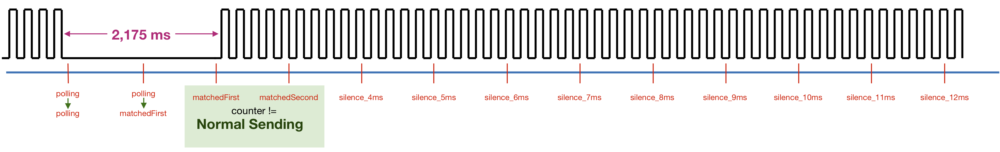
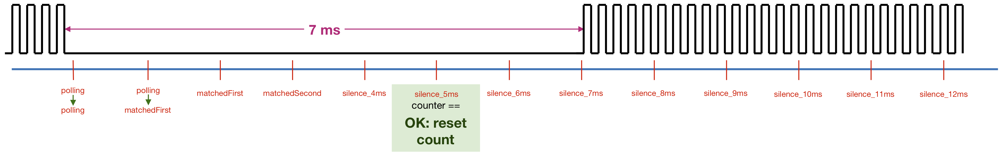
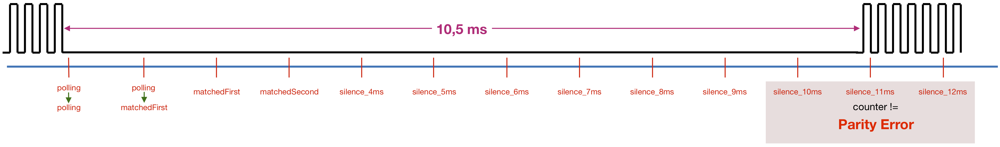
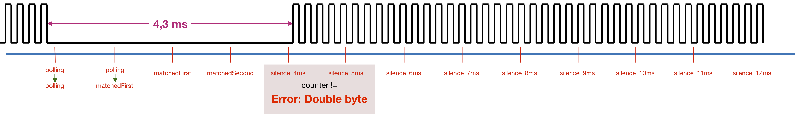

# RS-bus monitor #

It is relatively simple to write an Arduino sketch that monitors the RS-bus operation. The following aspects can be monitored:
- from which RS-bus address a message is send
- if the Command Station signals a (parity) error (10,7ms of silence, instead of 7ms)
- if a decoder takes 4ms for transmission (double byte), instead of 2ms
- if interference from external electrical sources insert extra pulses

In the examples directory of this library a basic monitoring sketch is included. Its source is included below.


It should be noted that the contents of the data bytes that feedback decoders send to the master station can *not* be monitored with the normal RS-bus feedback decoder hardware (such as found on [https://easyeda.com/aikopras/rs-bus-tht](https://easyeda.com/aikopras/rs-bus-tht)). Monitoring the contents of the data bytes requires special hardware, such as described on [https://sites.google.com/site/dcctrains/dcc-rs-bus-monitor/rs-bus](https://sites.google.com/site/dcctrains/dcc-rs-bus-monitor/rs-bus). Alternatively the contents of data bytes by feedback decoders can be monitored via Lenz's own LAN/USB Interface (serial number: 23151); MAC OSX software that is able to show such contents can be downloaded from: [https://github.com/aikopras/DCCMonitor](https://github.com/aikopras/DCCMonitor). A Windows version of such software has not been written, so this is a nice task for other open source enthusiasts.











# References: #
- Der-Moba (in German): http://www.der-moba.de/index.php/RS-Rückmeldebus
- https://sites.google.com/site/dcctrains/rs-bus-feed
- https://sites.google.com/site/dcctrains/dcc-rs-bus-monitor/rs-bus
- https://github.com/aikopras/DCCMonitor
- https://easyeda.com/aikopras/rs-bus-tht
- https://easyeda.com/aikopras/rs-bus-smd


# Monitor example code #
```
//******************************************************************************************************
//
// Example for the Arduino RS-Bus library: RS-Bus monitor.
//
// The purpose of this sketch is to detect:
// a) from which RS-bus address a message is send (the RS-bus data itself can't be measured!)
// b) if the Command Station signals a (parity) error (10,7ms of silence, instead of 7ms)
// c) if a decoder takes 4ms for transmission (double byte), instead of 2ms
// d) if interference from external electrical sources insert exra pulses
//
// 2021-11-9 / AP: Version 1
//
// This sketch is inspired by the RS-bus library software, but does NOT use the RS-bus library itself.
// Has been tested on the Arduino UNO and the AVR128-DA48 Curiosity Board
//
// RsBus_RX: The Arduino pin number.
// The newer MegaCoreX and DxCore processors can use basically every pin to generate interrupts.
// Pin PA0 (Arduino pinnumber 0) might be a good choice as default pin.
// Traditional Arduino's, such as UNO or Mega, should use one of the INTx pins (see below).
// INTx pins for traditional Arduinoe's:
//  Interrupt   Port   Pin   Where
//    INT0      PD2      2   UNO, NANO
//    INT1      PD3      3   UNO, NANO
//    INT0      PD0     21   MEGA
//    INT1      PD1     20   MEGA
//    INT2      PD2     19   MEGA
//    INT3      PD3     18   MEGA
//    INT4      PE4      2   MEGA
//    INT5      PE5      3   MEGA
//
//******************************************************************************************************
#include <Arduino.h>

const uint8_t RsBus_RX = 2;             // See above
const uint8_t ledPin = 13;              // Pin for the LED. Usually Pin 13


//******************************************************************************************************
// No need to modify what comes below
volatile uint8_t isrCounter = 0;
unsigned long currentTime;              // Current Time (in msec)
unsigned long tLastCheck;               // Previous Time (in msec)
uint8_t addressPolled;                  // Local copy (to avoid changes by the ISR) of isrCounter
uint8_t previousAddressPolled = 0;      // Previous value of addressPolled
bool signalDetected = false;            // Flag: RS-bus signal is detected and address is synchronized

enum PollState {                        // The state machine for detct_address
  polling,
  matchedFirst,
  matchedSecond,
  silence_4ms,
  silence_5ms,
  silence_6ms,
  silence_7ms,
  silence_8ms,
  silence_9ms,
  silence_10ms,
  silence_11ms,
  silence_12ms,
  signalLost
} pollState;


//**************************************** ISR *******************************************  
// Interrupt Service Machine
void rs_interrupt(void) {
  isrCounter ++;        // Address of slave that gets his turn next
}

//**************************************** Main *******************************************  
void setup() {
  pinMode(ledPin, OUTPUT);
  attachInterrupt(digitalPinToInterrupt(RsBus_RX), rs_interrupt, RISING);
  Serial.begin(115200);
  delay(500);
  Serial.println("Start");
}


void monitor() {
  currentTime = micros();                              // Local copy: no changes during sub routine
  if ((currentTime - tLastCheck) >= 1000) {            // Check once every 1 ms
    tLastCheck = currentTime;
    addressPolled = isrCounter;                        // will not chance during sub routine
    switch (pollState) {
      case polling:
        if (addressPolled == previousAddressPolled) pollState = matchedFirst;
        else previousAddressPolled = addressPolled;
      break;
      case matchedFirst:
        if (addressPolled == previousAddressPolled) pollState = matchedSecond;
        else {
          if (signalDetected) Serial.println(previousAddressPolled-1);
          pollState = polling;
          previousAddressPolled = addressPolled;
        }
      break;
      case matchedSecond:
        if (addressPolled == previousAddressPolled) pollState = silence_4ms;
        else {
          if (signalDetected) Serial.println(previousAddressPolled-1);
          pollState = polling;
          previousAddressPolled = addressPolled;
        }
      break;
      case silence_4ms:
        if (addressPolled == previousAddressPolled) pollState = silence_5ms;
        else {
          if (signalDetected) {
            Serial.print("Double byte: ");
            Serial.println(previousAddressPolled-1);
          }
          pollState = polling;
          previousAddressPolled = addressPolled;
        }
      break;
      case silence_5ms:
        if (addressPolled == previousAddressPolled) {
          pollState = silence_6ms;
          isrCounter = 0;
          previousAddressPolled = 0;
          if (addressPolled == 130) {
            if (signalDetected == false) Serial.println("Signal detected");
            signalDetected = true;
          }
          else {
            if (signalDetected) {
              Serial.print("Count error: ");
              Serial.println(addressPolled);  
            }          
          }
        }
        else {
          if (signalDetected) {
            Serial.print("Double byte: ");
            Serial.println(previousAddressPolled-1);
          }
          pollState = polling;
          previousAddressPolled = addressPolled;
        }        
      break;
      case silence_6ms:
        if (addressPolled == 0) pollState = silence_7ms;
        else {
          pollState = polling;
          previousAddressPolled = addressPolled;
        }
      break;
      case silence_7ms:
        if (addressPolled == 0) pollState = silence_8ms;
        else {
          pollState = polling;
          previousAddressPolled = addressPolled;
        }
      break;
      case silence_8ms:
        if (addressPolled == 0) pollState = silence_9ms;
        else {
          pollState = polling;
          previousAddressPolled = addressPolled;
        }
      break;
      case silence_9ms:
        if (addressPolled == 0) pollState = silence_10ms;
        else pollState = polling;
      break;
      case silence_10ms:
        if (addressPolled == 0) pollState = silence_11ms;
        else {
          pollState = polling;
          previousAddressPolled = addressPolled;
          if (signalDetected) Serial.println("Parity Error");
        }
      break;
      case silence_11ms:
        if (addressPolled == 0) pollState = silence_12ms;
        else {
          pollState = polling;
          previousAddressPolled = addressPolled;
          if (signalDetected) Serial.println("Parity Error");
        }
      break;
      case silence_12ms:
        if (addressPolled == 0) {
          if (signalDetected) Serial.println("Signal lost");
          pollState = signalLost;
          signalDetected = false;
        }
        else {
          pollState = polling;  
          previousAddressPolled = addressPolled;
          if (signalDetected) Serial.println("Parity Error");
        }
      break;
      case signalLost:
        if (addressPolled != 0) pollState = polling;
      break;
    };
  }
}


void loop() {
  // Turn LED on if a RS-bus signal is detected
  if (signalDetected) digitalWrite(ledPin, HIGH);
  else digitalWrite(ledPin, LOW);
  // State machine:
  monitor();
}
```
