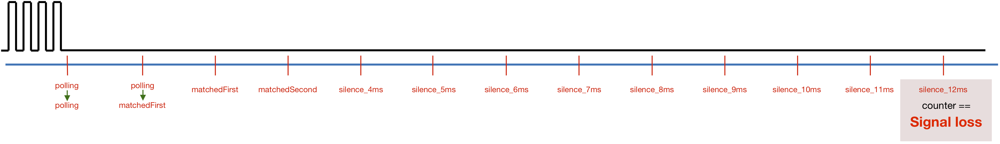

# RS-bus monitor #

It is relatively simple to write an Arduino sketch that monitors the RS-bus operation. The following aspects can be monitored:
- from which RS-bus address a message is send
- if the Command Station signals a (parity) error (10,7ms of silence, instead of 7ms)
- if a decoder takes 4ms for transmission (double byte), instead of 2ms
- if interference from external electrical sources insert extra pulses

It should be noted that the contents of the data bytes that feedback decoders send to the master station can *not* be monitored with the normal RS-bus feedback decoder hardware (such as found on [https://easyeda.com/aikopras/rs-bus-tht](https://easyeda.com/aikopras/rs-bus-tht)). Monitoring the contents of the data bytes requires special hardware, such as described on [https://sites.google.com/site/dcctrains/dcc-rs-bus-monitor/rs-bus](https://sites.google.com/site/dcctrains/dcc-rs-bus-monitor/rs-bus). Alternatively the contents of data bytes by feedback decoders can be monitored via Lenz's own LAN/USB Interface (serial number: 23151); MAC OSX software that is able to show such contents can be downloaded from: [https://github.com/aikopras/DCCMonitor](https://github.com/aikopras/DCCMonitor). A Windows version of such software has not been written, so this is a nice task for other open source enthusiasts.

# References:
- Der-Moba (in German): http://www.der-moba.de/index.php/RS-Rückmeldebus
- https://sites.google.com/site/dcctrains/rs-bus-feed
- https://sites.google.com/site/dcctrains/dcc-rs-bus-monitor/rs-bus
- https://github.com/aikopras/DCCMonitor
- https://easyeda.com/aikopras/rs-bus-tht
- https://easyeda.com/aikopras/rs-bus-smd
