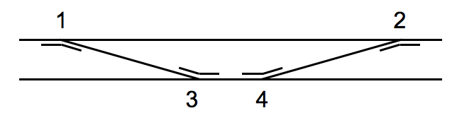
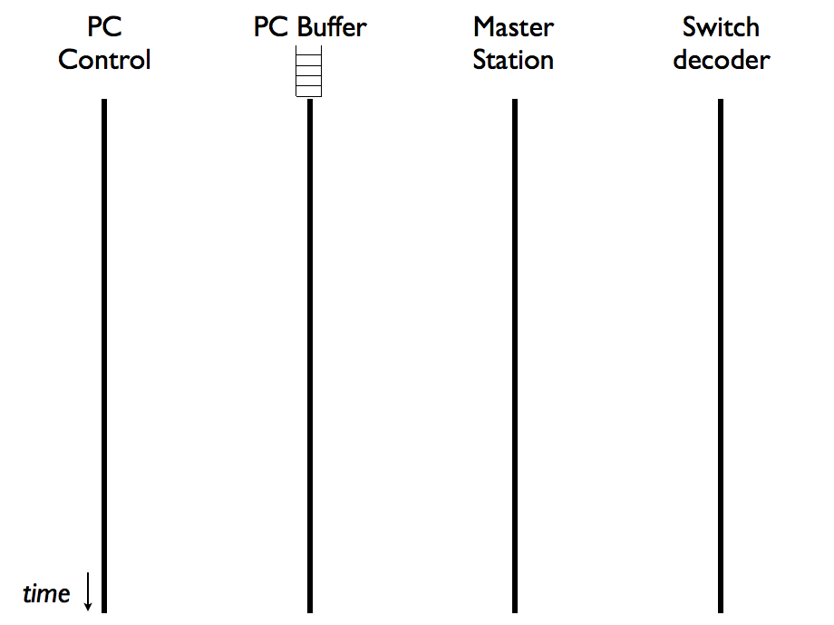
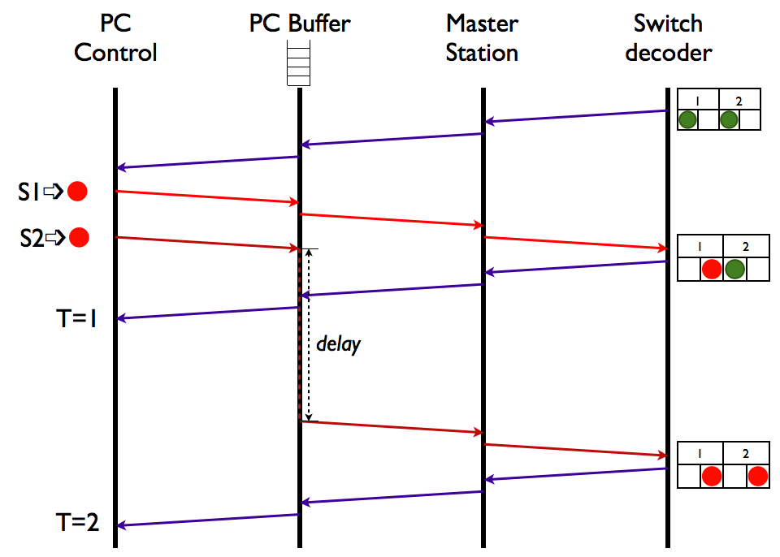

## Switch feedback Problems ##

On Internet fora and in vendor' FAQs you often read that feedback of switch positions is unreliable. But what exactly makes switch feedback unreliable and can it be made reliable? To understand the problems that many systems have and to learn how to solve these problems, we have to dive a bit deeper into the details of feedback systems.

Assume we have a layout with four switches, as shown in the figure below. The switches have DCC addresses from 1 to 4. It is clear that the switches have a certain relationship; if the position of switch 1 is straight (train stays on the upper track), the potion of switch 2 should be straight as well.

The following time-sequence diagram will be used to explain what happens if the system is powered on and the computer program that control the layout is changing the position of switches 1 and 2.

From left to right the diagram shows respectively the computer program that controls the layout (such as, for example, Train controller), a buffer that is part of such computer program (explained further below), the master station (such as the Lenz LZV 100) and the switch decoder (such as OpenDecoder 2.2) that controls the four switches of our layout.

Vertically the diagram shows the time; in our example the difference between start and end time may be less than a second. Given such short times, the scenario described below will only occur if the layout is controlled by a computer program; if the layout is controlled by a human being (who is pushing buttons on a hand-held controller, such as the Lenz LH 100) reaction time of that human being may be too slow to allow the scenario below to be replayed.

### Role of the buffer ###
If a switch engine is activated, for a short period (in the order of tenths to hundreds of milliseconds) the current flowing through the coil within the switch engine can reach values between 0,5 and 1 Ampere. If multiple switch engines are activated simultaneously, the total current to be delivered by the transformer will be the sum of the individual currents. If, for example, ten switches are activated simultaneously, the total current the transformer must be able to deliver (for a short period) will be between 5 and 10 Amperes. In most cases the transformer will be unable to deliver such high currents. Instead the transformer may signal a short circuit, and (some of) the switch positions may not be changed.

To avoid such high currents, computer programs for controlling train layouts will generally introduce a short delay between the various switch activation commands. Such delays will typically be 250 milliseconds, although several programs allow these delay values to be altered. So, if ten switches should be activated simultaneously, the first command will be performed immediately, the second after 250 milliseconds, the third after 500 milliseconds and so on. To simplify the writing of a computer program, the program is usually divided into multiple processes. One process is than responsible for controlling the layout, which involves (amongst others) monitoring the actual switch positions and generating commands to change the switch positions. Another process is than responsible for buffering the switch commands and introducing possible delays. In the time-sequence diagram these two processes are shown separately.

### RS-bus scenario ###
After power is switch on, the switch decoder will send the actual switch positions to the master station, and the master station will forward this feedback signal to the PC. Several feedback systems, including the RS-bus (RS-bus is a trademark by Lenz), send multiple switch positions in a single feedback message. Thus, in the time-sequence diagram example shown below, the switch decoder informs through a single feedback message the PC (via the master station) that the switch positions of both switches 1 and 2 are green (sequence of blue arrows at the top).

Assume that the layout control process on the PC now wants to change the positions of both switch 1 and 2 to red. For that purpose the control process issues two consecutive DCC commands; one for changing switch 1 to red (light red arrows), and another to change the position of switch 2 to red (dark red arrows). Note that, for good reasons, the DCC specification does not allow to change the position of multiple switches via a single DCC command. Since the control process will be fast enough to generate many commands per second, the interval between both DCC switch commands may be in the order of milliseconds. The buffer process will immediately forward the first DCC switch command, but buffer the second DCC switch command for around 250 milliseconds. The first DCC switch command will therefore arrive (via the master station) at the switch decoder more or less immediately (in practice the entire sequence may take several tenths of milliseconds); whereas the second DCC switch command will arrive 250 milliseconds later.

Immediately after the first DCC switch command is received by the switch decoder, the command will be executed and a feedback message will be issued. The feedback message states that the position of switch 1 is now red, but the position of switch 2 is still green (since the second DCC switch command has not yet been received by the switch decoder). The control process on the PC will receive this feedback signal at time T=1, which in practice may be around 100 milliseconds after the switch commands were issued. Many PC programs will conclude at this moment that he position of switch 1 has successfully been changed, but also conclude (erroneously) that changing the position of switch 2 has failed (since the position of switch 2 is still green, instead of red). Depending on the PC program being used, an error may now be raised and switch 2 may get blocked. Most programs  are not intelligent enough to realize that the second DCC command was buffered for 250 milliseconds, and that conclusions regarding the proper operation of switch 2 should be postponed until time T=2.

It should be noted, however, that implementing such intelligence is not trivial, since the program should know the peculiarities of many different command (DCC, MM, Selectrix) and feedback (RS-bus, Loconet, S88, etc.) systems, be able to deal with various possible error situations and consider different timing options (switch engines based on servo's or DC motors can easily take seconds before reaching a new position, whereas coil-based switch engines usually take tenths of milliseconds).

Note also that the RS-bus scenario described above is not 100 percent correct, since RS-bus messages are only exchanged between switch decoder and master station. The master station translates these RS-bus messages into semantically equivalent xpressnet messages (thus with equivalent content), and forwards these XpressNet messages to the PC.

### XpressNet scenario ###
Although the scenario described above assumes usage of RS-bus feedback messages, similar problems may occur with other feedback buses, such as the feedback bus used by OpenDecoder v2. Although the OpenDecoder feedback bus uses separate feedback messages for each switch position (which is an improvement compared to the RS-bus), the OpenDecoder command station may now introduce the problems that were described above. The reason is that the command station uses XpressNet messages to communicate with the PC (note that the OpenDecoder command station is not bound to the XpressNet, but may also use other protocols between master station and PC). The XpressNet, but several other protocols as well, also send multiple feedback signals within a single message. If a master station is informed by a switch that the position of a switch is changed, the master station will send this information, together with previously stored information of other switches, in a single feedback message to the PC.

### Avoiding switch feedback problems ###
Several possibilities exist to avoid the switch feedback problems explained above.
- The first possibility is to write a more intelligent PC control program; such possibility may not be feasible in practice, however.
- The second possibility is to develop new hardware, based on better protocols. However, the problem remains that such hardware should still be able to communicate with existing PC train control software. Therefore the communication protocol between master station and PC should still be known by the PC control program, unless a new PC control program is written. Again this possibility may hardly be feasible in practice.
- The third, and more realistic possibility is to assign the addresses of switches in such a way, that the above problems can never occur. In practice this means that only the uneven (1, 3, 5, …) or only the even addresses (2, 4, 6, …) are used. As a consequence, only half of the address space will be available, and thus the maximum number of switches will be half of the theoretical maximum. In practice this limitation may often be acceptable, however. If needed, some train controller programs allow the use of multiple command stations and feedback buses.
- Since existing switch decoders cannot be programmed to use only uneven (or even) addresses, following this approach would mean that the number of required switch decoders would be doubled (per decoder only two switches, instead of four). The software used for the decoders described on this websitr was therefore modified, to enable the use of uneven address only. For this purpose the CV 539 ("SkipUneven") should be set.
